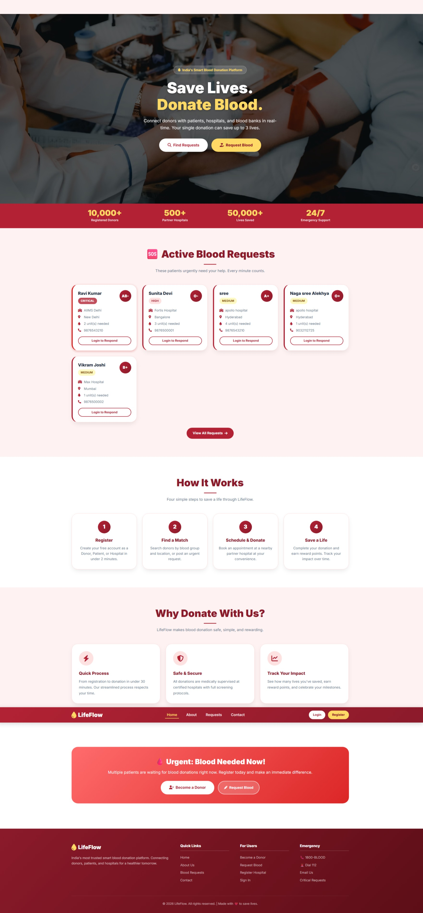
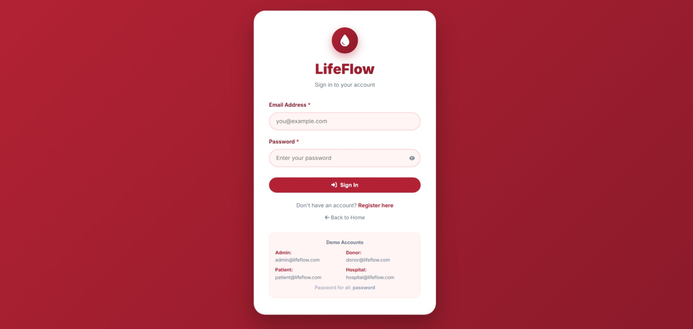
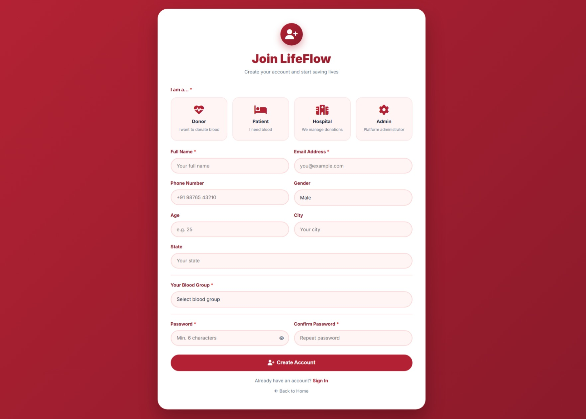
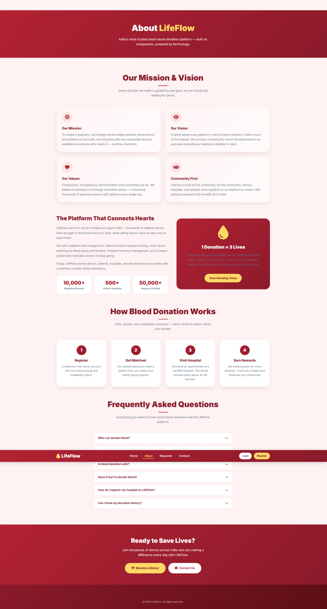
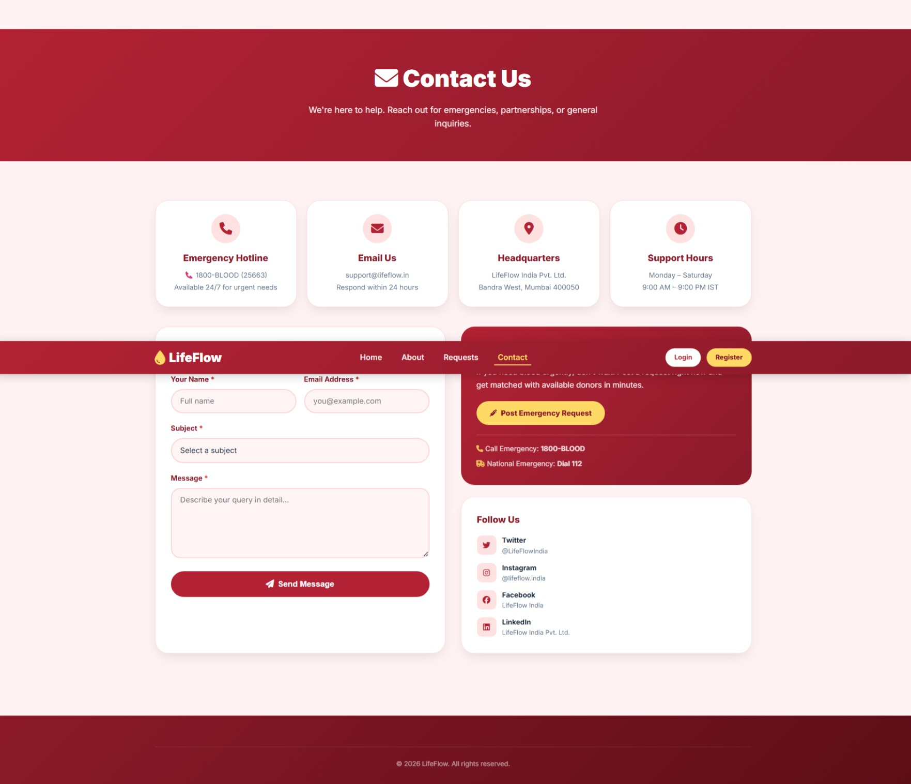

# 🩸 LifeFlow - Smart Online Blood Donation Platform

A **PHP & MySQL-based Smart Online Blood Donation Platform** that connects **Donors, Patients, Hospitals, and Administrators** through a secure and user-friendly web application.

---

## 📌 Project Overview

LifeFlow is a web-based blood donation management system developed using **PHP**, **MySQL**, **HTML**, **CSS**, and **JavaScript**. The platform simplifies blood donation by allowing donors to register, hospitals to manage blood inventory, patients to request blood, and administrators to monitor the entire system.

---

## ✨ Features

- 👤 Multi-role Authentication (Admin, Donor, Patient, Hospital)
- 🔐 Secure Login & Registration
- 🩸 Blood Request Management
- 🏥 Hospital Blood Inventory Management
- 👥 Donor Search by Blood Group
- 📊 Admin Dashboard
- ✏️ Profile Management
- 📱 Responsive User Interface
- 📧 Contact Form
- 🔒 Password Hashing (bcrypt)
- ⚡ Session-based Authentication

---

## 🛠️ Technologies Used

| Technology | Purpose |
|------------|---------|
| HTML5 | Structure |
| CSS3 | Styling |
| JavaScript | Client-side Interactivity |
| PHP 8+ | Backend Development |
| MySQL | Database |
| XAMPP | Local Development Environment |

---

## 📂 Project Structure

```text
LifeFlow/
│
├── css/
│   └── style.css
│
├── js/
│   └── app.js
│
├── php/
│   ├── index.php
│   ├── login.php
│   ├── register.php
│   ├── logout.php
│   ├── dashboard.php
│   ├── donor_dashboard.php
│   ├── patient_dashboard.php
│   ├── hospital_dashboard.php
│   ├── admin_dashboard.php
│   ├── blood_request.php
│   ├── view_requests.php
│   ├── about.php
│   ├── contact.php
│   └── edit_profile.php
│
├── Screenshots/
│
├── database.sql
├── db_connect.php
└── README.md
```

---

## ⚙️ Installation Guide

### 1️⃣ Clone the Repository

```bash
git clone https://github.com/nagasreealekhya-blip/Smart-Online-Blood-Donation-Platform.git
```

### 2️⃣ Move the Project

Copy the project folder to:

```
C:\xampp\htdocs\
```

### 3️⃣ Start XAMPP

Start:

- Apache
- MySQL

### 4️⃣ Create Database

Create a database named:

```
lifeflow
```

### 5️⃣ Import Database

Import:

```
database.sql
```

using phpMyAdmin.

### 6️⃣ Configure Database

Edit:

```
db_connect.php
```

Set your database credentials.

### 7️⃣ Run the Project

Open:

```
http://localhost/lifeflow/php/index.php
```

---

## 👥 Demo Accounts

| Role | Email | Password |
|------|-------|----------|
| Admin | admin@lifeflow.com | password |
| Donor | donor@lifeflow.com | password |
| Patient | patient@lifeflow.com | password |
| Hospital | hospital@lifeflow.com | password |

---

# 📸 Project Screenshots

## 🏠 Home Page



## 🔐 Login Page



## 📝 Registration Page



## ℹ️ About Page



## 📞 Contact Page



## 🩸 Blood Request Page


## 📋 View Requests Page


## 🔮 Future Enhancements

- Email Notifications
- SMS Alerts
- Blood Donation Appointment Booking
- Google Maps Integration
- PDF Report Generation
- Dark Mode
- REST API Support

---

## 👩‍💻 Author

**Naga Sree Alekhya**

GitHub: https://github.com/nagasreealekhya-blip

---

## 📄 License

This project is developed for educational and learning purposes.

---

# ❤️ Every Drop Counts. Save Lives.